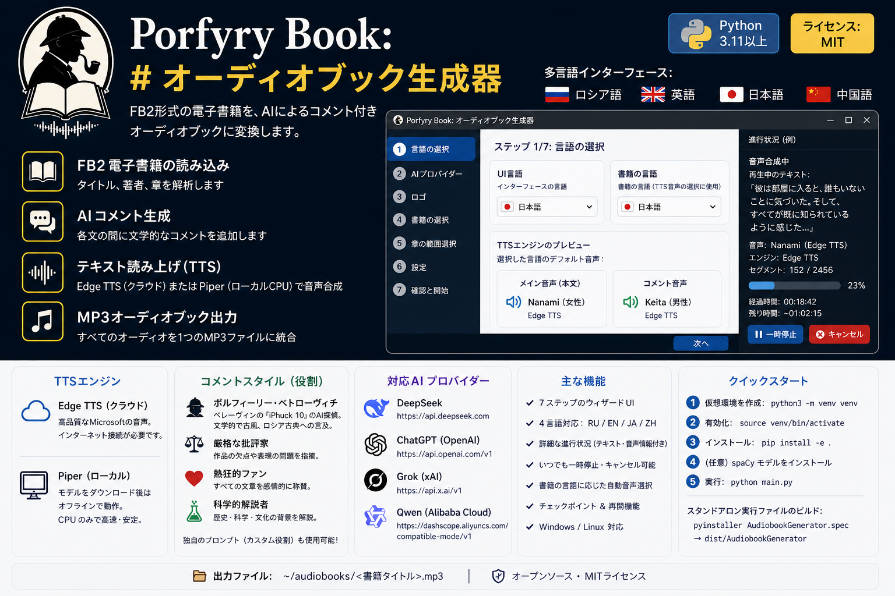

# Audiobook Generator

**FB2電子書籍をAIコメント付きオーディオブックに変換します。**


[](https://www.python.org/)
[](LICENSE)

**🌍 言語:** [English](README.md) | [Русский](README.ru.md) | [中文](README.zh.md)

**多言語UI:** 日本語 · English · Русский · 中文

---

## 概要

デスクトップアプリ（Windows/Linux）：

1. FB2電子書籍を読み込む
2. 文章を文に分割
3. **オプションで** 文間にAIコメントを追加（無効化可能）
4. **TTS**（Edge TTS、Piper、Supertonic 3、またはSilero TTS v5）で音声合成
5. 1つのMP3ファイルとして保存

技術スタック：Python + CustomTkinter。DeepSeek、ChatGPT、Grok、Qwenに対応。

インターフェースは**4言語**に対応 — 最初のウィザードページで即座に切り替え可能。

---

## クイックスタート

### 前提条件

- Python 3.11+
- [ffmpeg](https://ffmpeg.org/)（音声処理に必要）
  - Linux: `sudo apt install ffmpeg`
  - Windows: ffmpeg.orgからダウンロードしてPATHに追加
- （オプション）[piper-tts](https://github.com/rhasspy/piper) — ローカルCPUベースのTTS（インターネット不要）
- （オプション）`pip install -e .[supertonic]` — Supertonic 3（ローカル、31言語、~305 MB）
- （オプション）`pip install -e .[silero]` — Silero TTS v5（ローカル、ロシア語に最適なオープンソースTTS、~150 MB、PyTorch必要）

### インストールと実行

```bash
# 1. 仮想環境を作成（Debian 13+では必須）
python3 -m venv venv

# 2. 有効化
source venv/bin/activate   # Linux
# venv\Scripts\activate    # Windows

# 3. アプリと依存関係をインストール
pip install -e .

# 4. （オプション）追加TTSエンジンをインストール
pip install -e .[supertonic]  # Supertonic 3

# SileroをCPUで使う場合（推奨 — PyTorchと全依存関係をインストール）：
pip install torch torchaudio --index-url https://download.pytorch.org/whl/cpu
pip install -e .[silero]

#   （上記2つのコマンドはSileroに必要です。不要な場合はスキップしてください）

# 5. （オプション）spaCyモデルをインストール（文分割の精度向上）
python -m spacy download ru_core_news_sm  # ロシア語
python -m spacy download en_core_web_sm   # 英語
python -m spacy download ja_core_news_sm  # 日本語
python -m spacy download zh_core_web_sm   # 中国語

# 5. 実行
python main.py
```

Makefileを使用する場合：

```bash
make install   # 手順1-3
make run       # 手順5
```

---

## スタンドアロン実行ファイルのビルド

Pythonがなくても実行できる単一ファイルにバンドル：

```bash
# venvを有効化してから：
pip install pyinstaller

# オプションA: specファイルを使用（推奨 — logo.pngを含む）
pyinstaller AudiobookGenerator.spec

# オプションB: Makefileを使用
make build

# 実行ファイル: ./dist/AudiobookGenerator
```

---

## 使い方

**7ステップのウィザード**（多言語対応）：

| ステップ | 操作 |
|---------|------|
| 1 | **UI言語**（全ページに即座に反映）と**書籍の言語**（対応TTS音声が自動選択）を選択 |
| 2 | AIプロバイダーを選択（DeepSeek/ChatGPT/Grok/Qwen）しAPIキーを入力。**AIコメントが不要な場合は「次へ」をクリック。キーは必須ではありません** |
| 3 | ロゴ画面 |
| 4 | FB2ファイルを選択（タイトル、著者、章が表示） |
| 5 | 範囲を選択：全章、範囲指定、または1つの章 |
| 6 | AIコメントのオン/オフを設定（チェックボックス）。コメント頻度、コメンテーターロール、カスタムプロンプト、**およびTTSエンジンを選択**（Edge TTS、Piper、Supertonic 3、Silero TTS v5） |
| 7 | 設定を確認して**起動**をクリック |

生成中は**詳細進捗ウィンドウ**が表示：
- 現在の段階（解析、コメント、合成、結合）
- 合成中：**発声中のテキスト**、音声名、エンジン名、セグメント番号
- 経過時間と推定残り時間
- **一時停止**と**キャンセル**ボタン

出力先: `~/audiobooks/<書籍タイトル>.mp3`

---

## TTSエンジン

### Edge TTS（デフォルト、クラウド）

アプリは**無料**のMicrosoft Edge TTS音声を使用します。高品質ですが、インターネット接続が必要です。言語ごとのデフォルト音声：

| 言語 | メイン音声（テキスト） | コメンテーター音声 |
|------|---------------------|------------------|
| 🇷🇺 ロシア語 | **Svetlana**（女性） | **Dmitry**（男性） |
| 🇬🇧 英語 | **Jenny**（女性） | **Guy**（男性） |
| 🇯🇵 日本語 | **Nanami**（女性） | **Keita**（男性） |
| 🇨🇳 中国語 | **Xiaoxiao**（女性） | **Yunxi**（男性） |

**音声は自動的に更新されます** — ステップ1で書籍の言語を変更すると、対応するデフォルト音声が適用されます。`~/.audiobook-generator/settings.toml` で上書きすることもできます。[完全なEdge TTS音声リスト](https://learn.microsoft.com/en-us/azure/ai-services/speech-service/language-support?tabs=tts)から任意の音声を使用可能です。

### Piper（ローカル、CPU）

[Piper](https://github.com/rhasspy/piper) は高速なローカルニューラルTTSエンジンで、完全にCPU上で動作します。インターネット接続は不要です。

- **初回モデルダウンロード後はインターネット不要**
- 音声は初回使用時に自動ダウンロードされ、ローカルにキャッシュされます
- Edge TTSより品質はやや低いですが、完全に安定しています
- 利用可能な音声：

| 言語 | 音声 |
|------|------|
| 🇷🇺 ロシア語 | **irina**（女性）、**denis**（男性）、**dmitri**（男性）、**ruslan**（男性） |
| 🇬🇧 英語 | **less**（女性）、**amy**（女性）、**joe**（男性）、**sam**（男性）、**ryan**（男性）、**norman**（男性）、**kristin**（女性）、**kusal**（男性） |
| 🇨🇳 中国語 | **chaowen**（女性）、**huayan**（女性）、**xiao_ya**（女性） |

**インストール方法:** [リリースページ](https://github.com/rhasspy/piper/releases)から `piper` をダウンロードしてPATHに追加するか、`pip install piper-tts` でインストール（Linuxでは手動ビルドが必要な場合があります）。

### Supertonic 3（ローカル、GPU/CPU）

[Supertonic 3](https://github.com/supertone-inc/supertonic) by Supertone Inc. — ONNX RuntimeベースのモダンなローカルTTS。CPUで動作し、GPUは不要です。

- **初回モデルダウンロード後はインターネット不要**（~305 MB）
- モダンなアーキテクチャ（flow-matching, ConvNeXt）— 明瞭で自然な音声
- 31言語対応（ロシア語、英語含む）
- CPUでもリアルタイムの5-6倍の速度
- 10種類の音声：女性5声（F1-F5）+ 男性5声（M1-M5）

| 言語 | メイン音声（テキスト） | コメンテーター音声 |
|------|---------------------|------------------|
| 🇷🇺 ロシア語 | **F1 — Anna**（女性） | **M1 — Porfiry**（男性） |
| 🇬🇧 英語 | **F1**（女性） | **M1**（男性） |

**インストール:** `pip install -e .[supertonic]` — モデルは初回実行時に自動ダウンロードされます（~305 MB）。

### Silero TTS v5（ローカル、CPU）

[Silero TTS v5](https://github.com/snakers4/silero-models) — Sileroチームによる事前学習済みTTSモデル。ロシア語に最適なオープンソースTTSです。

- **初回モデルダウンロード後はインターネット不要**（~150 MB）
- 自動アクセントと同形異義語のサポート（ロシア語）
- FastSpeech 2アーキテクチャ — 優れた明瞭さ
- UTMOS 3.04（ロシア語の自然性が人間の声に近い）
- SSMLサポート

| 言語 | メイン音声（テキスト） | コメンテーター音声 |
|------|---------------------|------------------|
| 🇷🇺 ロシア語 | **xenia**（女性） | **eugene**（男性） |
| 🇬🇧 英語 | **lj_16khz**（女性） | **random**（男性） |

**インストール:**
```bash
# CPU（ほとんどのユーザーに推奨）：
pip install torch torchaudio --index-url https://download.pytorch.org/whl/cpu
pip install -e .[silero]

# CUDA GPUがある場合：
pip install -e .[silero]
```

モデル（v5_ru）は初回使用時に自動ダウンロードされます（venv内の `silero_tts/silero_models/` ディレクトリに保存） — 初回は約1分かかりますが、その後はオフラインで動作します。

---

## 🎯 完全オフラインモード

**インターネットなしで** 全プロセスを実行できます：

1. **ステップ2**：APIキーをスキップ（AIコメントは生成されません）
2. **ステップ6**：**「AIコメントを生成」** のチェックを外す
3. ローカルTTSエンジンを選択：**Piper**、**Supertonic 3**、または **Silero TTS v5**

API呼び出し不要、クラウド依存不要。FB2解析 + ローカルTTS → オーディオブック。

---

## 組み込みコメンテーターロール

| ロール | スタイル |
|--------|---------|
| **ポルフィーリー・ペトローヴィチ** | ペレーヴィンの『iPhuck 10』に登場するAI探偵 — 文学的、古風、ロシア古典への言及 |
| **厳格な批評家** | 弱点や文体上の誤りを指摘 |
| **熱狂的なファン** | すべての一節に感嘆 |
| **科学的専門家** | 歴史的・科学的・文化的背景を解説 |

**カスタムプロンプト**を入力して独自のロールを作成することもできます。

---

## 対応AIプロバイダー

| プロバイダー | APIキー | ベースURL |
|-------------|---------|-----------|
| DeepSeek | 必須（コメント用） | `https://api.deepseek.com` |
| ChatGPT (OpenAI) | 必須（コメント用） | `https://api.openai.com/v1` |
| Grok (xAI) | 必須（コメント用） | `https://api.x.ai/v1` |
| Qwen (Alibaba Cloud) | 必須（コメント用） | `https://dashscope.aliyuncs.com/compatible-mode/v1` |

**注意：** APIキーはAIコメントを使用する場合のみ必要です。オフラインモードではこの手順を完全にスキップできます。

---

## プロジェクト構造

```
├── main.py                    # エントリーポイント — このファイルを実行
├── Makefile                   # install / run / build / clean
├── pyproject.toml             # 依存関係
├── AudiobookGenerator.spec    # PyInstaller spec（ビルド設定）
├── logo.png                   # アプリケーションロゴ
├── resources/
│   └── prompts.toml           # コメンテータープロンプトテンプレート
├── src/
│   ├── config/                # 設定、APIキー保存
│   ├── core/                  # FB2パーサー、文分割、AIコメント、
│   │                          # TTS（抽象基底 + Edge + Piper + Supertonic 3 + Silero）、音声アセンブリ、
│   │                          # チェックポイント、パイプラインオーケストレーター
│   ├── ui/                    # CustomTkinter GUI（7ステップウィザード、進捗ウィンドウ、コンポーネント）
│   └── utils/                 # ロギング、例外
└── tests/
```

---

## 設定

初回起動後に `~/.audiobook-generator/settings.toml` に保存されます。

変更可能：UI言語、書籍の言語、AIプロバイダー、TTSエンジン（edge/piper/supertonic/silero）、TTS音声/速度、ポーズ時間、コメント頻度、コメントのオン/オフ、出力ディレクトリ。

APIキーはシステムキーリングに安全に保存されます（暗号化ファイルによるフォールバック付き）。

---

## トラブルシューティング

**`pip install -e .` が `externally-managed-environment` で失敗する**
→ 仮想環境が必要です：`python3 -m venv venv && source venv/bin/activate && pip install -e .`

**音が出ない / ffmpegエラー**
→ ffmpegをインストール：`sudo apt install ffmpeg`（Linux）またはffmpeg.orgからダウンロード（Windows）

**Edge TTSが503/DNSエラーで失敗する**
→ ステップ6でローカルエンジン（**Piper**、**Supertonic 3**、または **Silero**）に切り替えてください。

**Piperが見つからない**
→ `piper` バイナリをインストールしてPATHに追加するか、別のエンジンを使用してください。

**Supertonic 3が動作しない / pip install supertonicが失敗する**
→ Pythonバージョン（3.11+）を確認してください。稀に `pip install --upgrade pip` が必要な場合があります。

**Silero TTS v5が動作しない / torchのインポートに失敗する**
→ PyTorchがインストールされていることを確認：`pip install torch torchaudio --index-url https://download.pytorch.org/whl/cpu`
→ 初回実行時にモデルが自動ダウンロードされます（~150 MB）。これに少し時間がかかる場合があります。

---

## ライセンス

MIT
