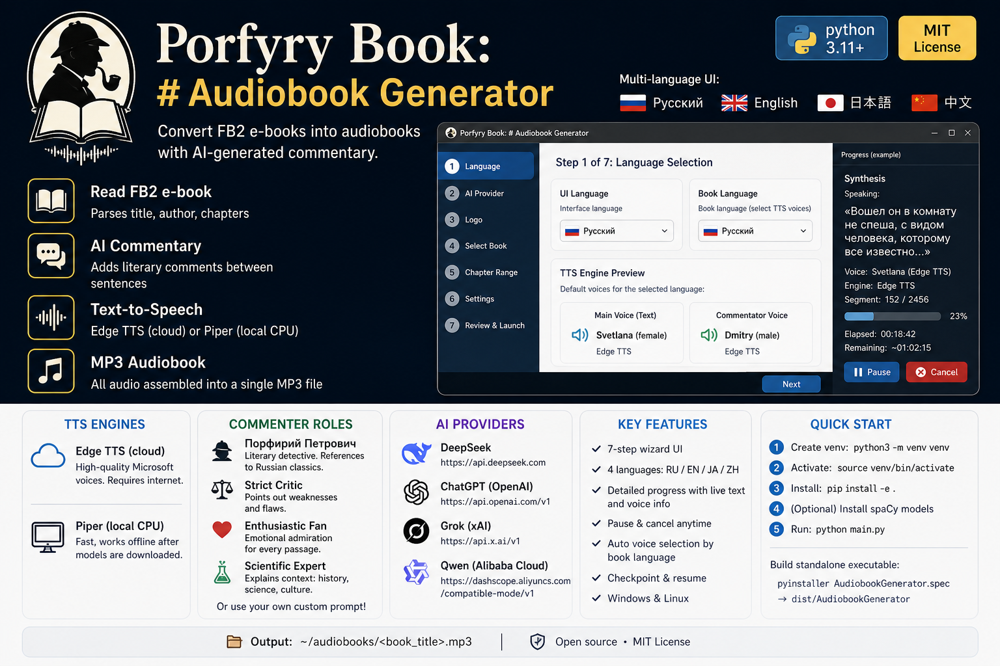

# Book v2 Audio

**FB2 → audiobook with AI-powered commentary.**


[](https://www.python.org/)
[](LICENSE)

**🌍 Languages:** [Русский](README.ru.md) | [日本語](README.ja.md) | [中文](README.zh.md)

**Multi-language UI:** Russian · English · Japanese · Chinese

---

## What is this?

A desktop app (Windows/Linux) that:

1. Reads an FB2 e-book
2. Splits it into sentences
3. **Optionally** adds AI-generated commentary between sentences (can be disabled)
4. Converts everything to speech via **TTS** (Edge TTS, Piper, Supertonic 3, or Silero TTS v5)
5. Saves as a single MP3 audiobook

Built with Python + CustomTkinter. Supports DeepSeek, ChatGPT, Grok, Qwen.

The interface is available in **4 languages** — switch instantly on the first wizard page.

---

## Quick Start

### Prerequisites

- Python 3.11+
- [ffmpeg](https://ffmpeg.org/) (for audio processing)
  - Linux: `sudo apt install ffmpeg`
  - Windows: download from ffmpeg.org and add to PATH
- (Optional) [piper-tts](https://github.com/rhasspy/piper) — for local CPU-based TTS (no internet needed)
- (Optional) `pip install -e .[supertonic]` — for Supertonic 3 (local, high quality, 31 languages, ~305 MB)
- (Optional) `pip install -e .[silero]` — for Silero TTS v5 (local, best Russian open-source quality, ~150 MB, requires PyTorch)

### Install & Run

```bash
# 1. Create virtual environment (required on Debian 13+)
python3 -m venv venv

# 2. Activate it
source venv/bin/activate   # Linux
# venv\Scripts\activate    # Windows

# 3. Install the app and core dependencies
pip install -e .

# 4. (Optional) Install optional TTS engines
pip install -e .[supertonic]  # Supertonic 3

# For Silero on CPU (recommended — installs PyTorch + all deps):
pip install torch torchaudio --index-url https://download.pytorch.org/whl/cpu
pip install -e .[silero]

#   (both commands above are required for Silero; skip if you don't need it)

# 5. (Optional) Install spaCy models for better sentence splitting
python -m spacy download ru_core_news_sm  # Russian
python -m spacy download en_core_web_sm   # English
python -m spacy download ja_core_news_sm  # Japanese
python -m spacy download zh_core_web_sm   # Chinese

# 6. Run
python main.py
```

Or use the Makefile:

```bash
make install   # steps 1-3
make run       # step 6
```

---

## Build a Standalone Executable

Bundle everything into a single file (no Python needed to run it):

```bash
# Activate venv first, then:
pip install pyinstaller

# Option A: use the spec file (recommended — includes logo.png)
pyinstaller AudiobookGenerator.spec

# Option B: use Makefile
make build

# The executable will be in ./dist/AudiobookGenerator
```

---

## How to Use

The app has a **7-step wizard** with multi-language support:

| Step | What you do |
|------|-------------|
| 1 | Select **UI language** (changes instantly across all pages) and **book language** (auto-selects matching TTS voices) |
| 2 | Choose AI provider (DeepSeek/ChatGPT/Grok/Qwen) and enter API key. **If you don't need AI comments — just click Next, the key is optional** |
| 3 | Logo screen |
| 4 | Pick an FB2 file (shows title, author, chapters) |
| 5 | Choose what to narrate: all chapters, a range, or one chapter |
| 6 | Toggle **AI comments on/off** (checkbox). Set comment frequency, pick a commenter role, and **choose TTS engine** (Edge TTS, Piper, Supertonic 3, or Silero TTS v5) |
| 7 | Review settings and click **Launch** |

During generation, a **detailed progress window** shows:
- Current stage (parsing, comments, synthesis, assembly)
- During synthesis: **the exact text being spoken**, voice name, engine name, and segment counter
- Elapsed and estimated remaining time
- **Pause** and **Cancel** buttons

Output: `~/audiobooks/<book_title>.mp3`

---

## TTS Engines

### Edge TTS (default, cloud-based)

Uses **free** Microsoft Edge TTS voices. High quality, but requires internet. Voice is selected automatically based on **book language** and **chosen gender** (Step 6):

| Language | Female → | Male → |
|----------|---------|-------|
| Russian  | `ru-RU-SvetlanaNeural` | `ru-RU-DmitryNeural` |
| English  | `en-US-JennyNeural` | `en-US-GuyNeural` |
| Japanese | `ja-JP-NanamiNeural` | `ja-JP-KeitaNeural` |
| Chinese  | `zh-CN-XiaoxiaoNeural` | `zh-CN-YunxiNeural` |

**Voices update automatically** with book language (Step 1) and gender selection (Step 6). Any voice from [the full Edge TTS list](https://learn.microsoft.com/en-us/azure/ai-services/speech-service/language-support?tabs=tts) can be used by editing `~/.audiobook-generator/settings.toml`.

### Piper (local, CPU)

[Piper](https://github.com/rhasspy/piper) is a fast, local neural TTS engine that runs entirely on CPU — no internet connection needed.

- **No internet required** after initial model download
- Voices are downloaded automatically on first use and cached locally
- Slightly lower quality than Edge TTS, but completely stable
- Available voices:

| Language | Voices |
|----------|--------|
| 🇷🇺 Russian | **irina** (female), **denis** (male), **dmitri** (male), **ruslan** (male) |
| 🇬🇧 English | **less** (female), **amy** (female), **joe** (male), **sam** (male), **ryan** (male), **norman** (male), **kristin** (female), **kusal** (male) |
| 🇨🇳 Chinese | **chaowen** (female), **huayan** (female), **xiao_ya** (female) |

**Installation:** Download `piper` from [releases](https://github.com/rhasspy/piper/releases) and add it to PATH, or install via `pip install piper-tts` (may require manual build on Linux).

### Supertonic 3 (local, GPU/CPU)

[Supertonic 3](https://github.com/supertone-inc/supertonic) by Supertone Inc. — modern local TTS on ONNX Runtime. Runs on CPU, no GPU needed.

- **No internet required** after initial model download (~305 MB)
- Modern architecture (flow-matching, ConvNeXt) — crisp, natural speech
- 31 languages including Russian and English
- 5-6× faster than real-time even on CPU
- 10 voices available: 5 female (F1-F5) + 5 male (M1-M5)

| Language | Main Voice (Text) | Commentator Voice |
|----------|-------------------|-------------------|
| 🇷🇺 Russian | **F1 — Anna** (female) | **M1 — Porfiry** (male) |
| 🇬🇧 English | **F1** (female) | **M1** (male) |

**Installation:** `pip install -e .[supertonic]` — the model downloads automatically on first run (~305 MB).

### Silero TTS v5 (local, CPU)

[Silero TTS v5](https://github.com/snakers4/silero-models) — pre-trained TTS models by the Silero team. The best open-source quality for Russian language.

- **No internet required** after initial model download (~150 MB)
- Automatic stress marks and homograph support (Russian-only)
- Built on FastSpeech 2 architecture — excellent clarity
- UTMOS 3.04 (near-human naturalness for Russian)
- Supports SSML for fine-grained control
- Available voices:

| Language | Female → | Male → |
|----------|---------|-------|
| Russian  | `xenia` | `eugene` |
| English  | `lj_16khz` | `random` |

**Installation:**
```bash
# CPU (recommended for most users):
pip install torch torchaudio --index-url https://download.pytorch.org/whl/cpu
pip install -e .[silero]

# If you have a CUDA GPU:
pip install -e .[silero]
```

The model (v5_ru) downloads automatically on first use (to your venv's `silero_tts/silero_models/` directory) — this takes about a minute on first run, then works offline.

Silero automatically detects the text language: **Cyrillic** → Russian voice (xenia/eugene), **Latin** → English voice (lj_16khz). For other languages (Japanese, Chinese) please use **Edge TTS** or **Supertonic 3**.

---

## 🎯 Fully Offline Mode

You can run the entire pipeline **without internet access**:

1. On **Step 2**: skip the API key (AI comments won't be generated)
2. On **Step 6**: uncheck **"Generate AI comments"**
3. Select a local TTS engine: **Piper**, **Supertonic 3**, or **Silero TTS v5**

No API calls, no cloud dependencies. Just FB2 parsing + local TTS → audiobook.

---

## Built-in Commenter Roles

| Role | Style |
|------|-------|
| **Порфирий Петрович** | AI detective from Pelevin's *iPhuck 10* — literary, old-fashioned, references to Russian classics |
| **Strict Critic** | Points out weaknesses and stylistic flaws |
| **Enthusiastic Fan** | Emotional admiration for every passage |
| **Scientific Expert** | Explains historical, scientific, and cultural context |

You can also enter a **custom prompt** for your own role.

---

## Supported AI Providers

| Provider | API Key | Base URL |
|----------|---------|----------|
| DeepSeek | Required (for comments) | `https://api.deepseek.com` |
| ChatGPT (OpenAI) | Required (for comments) | `https://api.openai.com/v1` |
| Grok (xAI) | Required (for comments) | `https://api.x.ai/v1` |
| Qwen (Alibaba Cloud) | Required (for comments) | `https://dashscope.aliyuncs.com/compatible-mode/v1` |

**Note:** API keys are only needed if you use AI comments. For offline mode, skip this step entirely.

---

## Project Structure

```
├── main.py                    # Entry point — run this
├── Makefile                   # install / run / build / clean
├── pyproject.toml             # Dependencies
├── AudiobookGenerator.spec    # PyInstaller spec (build configuration)
├── logo.png                   # Application logo
├── resources/
│   └── prompts.toml           # Commenter prompt templates
├── src/
│   ├── config/                # Settings, API key storage
│   ├── core/                  # FB2 parser, sentence splitter, AI comments,
│   │                          # TTS (abstract base + Edge + Piper + Supertonic 3 + Silero),
│   │                          # audio assembly, checkpoints, pipeline orchestrator
│   ├── ui/                    # CustomTkinter GUI (7 wizard pages, progress window, components)
│   └── utils/                 # Logging, exceptions
└── tests/
```

---

## Configuration

Settings are saved to `~/.audiobook-generator/settings.toml` after first run.

You can edit: UI language, book language, AI provider, TTS engine (edge/piper/supertonic/silero), voice genders (main_gender, comment_gender), speed, pause durations, comment frequency, comment on/off toggle, output directory.

API keys are stored securely in your system keyring (with encrypted file fallback).

---

## Troubleshooting

**`pip install -e .` fails with `externally-managed-environment`**
→ You need a virtual environment. Run `python3 -m venv venv && source venv/bin/activate && pip install -e .`

**No sound / ffmpeg errors**
→ Install ffmpeg: `sudo apt install ffmpeg` (Linux) or download from ffmpeg.org (Windows)

**Edge TTS fails with 503 / DNS errors**
→ Try switching to a local engine (**Piper**, **Supertonic 3**, or **Silero**) on step 6.

**Piper not found**
→ Install the `piper` binary and add it to PATH, or use another engine.

**Supertonic 3 not working / pip install supertonic fails**
→ Check your Python version (3.11+). In rare cases, `pip install --upgrade pip` may be needed.

**Silero TTS v5 not working / torch import fails**
→ Make sure PyTorch is installed: `pip install torch torchaudio --index-url https://download.pytorch.org/whl/cpu`
→ On first run, the model downloads automatically (~150 MB) — this may take a minute.

---

## License

MIT
