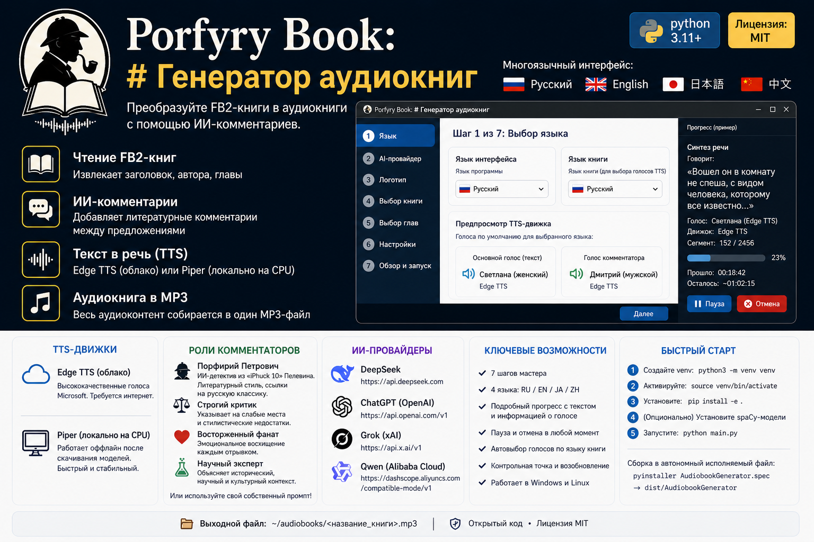

# Book v2 Audio

**Преобразуйте FB2-книги в аудиокниги с AI-комментариями.**


[](https://www.python.org/)
[](LICENSE)

**🌍 Языки:** [English](README.md) | [日本語](README.ja.md) | [中文](README.zh.md)

**Многоязычный интерфейс:** Русский · English · 日本語 · 中文

---

## Что это?

Десктопное приложение (Windows/Linux), которое:

1. Читает FB2-книгу
2. Разбивает на предложения
3. **Опционально** добавляет AI-комментарии между предложениями (можно отключить)
4. Преобразует текст в речь через **TTS** (Edge TTS, Piper, Supertonic 3 или Silero TTS v5)
5. Сохраняет как единый MP3-файл

Стек: Python + CustomTkinter. Поддержка DeepSeek, ChatGPT, Grok, Qwen.

Интерфейс доступен на **4 языках** — переключение мгновенно на первом шаге мастера.

---

## Быстрый старт

### Что нужно

- Python 3.11+
- [ffmpeg](https://ffmpeg.org/) (для обработки аудио)
  - Linux: `sudo apt install ffmpeg`
  - Windows: скачайте с ffmpeg.org и добавьте в PATH
- (Опционально) [piper-tts](https://github.com/rhasspy/piper) — для локального TTS на CPU (без интернета)
- (Опционально) `pip install -e .[supertonic]` — для Supertonic 3 (локальный, 31 язык, ~305 МБ)
- (Опционально) `pip install -e .[silero]` — для Silero TTS v5 (локальный, лучшее качество русского, ~150 МБ, требуется PyTorch)

### Установка и запуск

```bash
# 1. Создайте виртуальное окружение (обязательно на Debian 13+)
python3 -m venv venv

# 2. Активируйте
source venv/bin/activate   # Linux
# venv\Scripts\activate    # Windows

# 3. Установите приложение и основные зависимости
pip install -e .

# 4. (Опционально) Установите дополнительные TTS-движки
pip install -e .[supertonic]  # Supertonic 3

# Для Silero на CPU (рекомендуется — устанавливает PyTorch и всё нужное):
pip install torch torchaudio --index-url https://download.pytorch.org/whl/cpu
pip install -e .[silero]

#   (обе команды выше обязательны для Silero; пропустите, если он не нужен)

# 5. (Опционально) Установите spaCy-модели для лучшего разбиения на предложения
python -m spacy download ru_core_news_sm  # Русский
python -m spacy download en_core_web_sm   # Английский
python -m spacy download ja_core_news_sm  # Японский
python -m spacy download zh_core_web_sm   # Китайский

# 6. Запустите
python main.py
```

Или через Makefile:

```bash
make install   # шаги 1-3
make run       # шаг 6
```

---

## Сборка исполняемого файла

Упаковывает всё в один файл — Python не нужен:

```bash
# Активируйте venv, затем:
pip install pyinstaller

# Вариант A: через spec-файл (рекомендуется — включает logo.png)
pyinstaller AudiobookGenerator.spec

# Вариант B: через Makefile
make build

# Исполняемый файл: ./dist/AudiobookGenerator
```

---

## Как пользоваться

Приложение имеет **7-шаговый мастер** с поддержкой нескольких языков:

| Шаг | Что делаете |
|-----|-------------|
| 1 | Выбираете **язык интерфейса** (меняется мгновенно на всех страницах) и **язык книги** (автоматически подбирает голоса TTS) |
| 2 | Выбираете AI-провайдера (DeepSeek/ChatGPT/Grok/Qwen) и вводите API-ключ. **Если AI-комментарии не нужны — просто нажмите «Далее», ключ не обязателен** |
| 3 | Экран с логотипом |
| 4 | Выбираете FB2-файл (показывает название, автора, главы) |
| 5 | Выбираете объём: все главы, диапазон или одну главу |
| 6 | Включаете/выключаете **AI-комментарии** (чекбокс). Настраиваете частоту, роль комментатора, **выбираете TTS движок** (Edge TTS, Piper, Supertonic 3 или Silero TTS v5) и **пол голоса** для текста и комментатора ♂/♀ |
| 7 | Проверяете настройки и нажимаете **Запуск** |

Во время генерации **подробное окно прогресса** показывает:
- Текущий этап (парсинг, комментарии, синтез, склейка)
- Во время синтеза: **точный текст, который озвучивается**, имя голоса, название движка и номер сегмента
- Прошедшее и оставшееся время
- Кнопки **Пауза** и **Отмена**

Результат: `~/audiobooks/<название_книги>.mp3`

---

## TTS движки

### Edge TTS (по умолчанию, облачный)

Использует **бесплатные** голоса Microsoft Edge TTS. Высокое качество, требует интернет. Голос подбирается автоматически по языку книги и выбранному полу (шаг 6):

| Язык | Женский → | Мужской → |
|------|----------|----------|
| Русский | `ru-RU-SvetlanaNeural` | `ru-RU-DmitryNeural` |
| Английский | `en-US-JennyNeural` | `en-US-GuyNeural` |
| Японский | `ja-JP-NanamiNeural` | `ja-JP-KeitaNeural` |
| Китайский | `zh-CN-XiaoxiaoNeural` | `zh-CN-YunxiNeural` |

**Голоса обновляются автоматически** с языком книги (шаг 1) и выбором пола (шаг 6). Можно переопределить в `~/.audiobook-generator/settings.toml`. Доступен любой голос из [полного списка Edge TTS](https://learn.microsoft.com/en-us/azure/ai-services/speech-service/language-support?tabs=tts).

### Piper (локальный, CPU)

[Piper](https://github.com/rhasspy/piper) — быстрый локальный нейросетевой TTS, работающий полностью на CPU. Не нуждается в интернете.

- **Интернет не требуется** после первоначальной загрузки моделей
- Голоса скачиваются автоматически при первом использовании и кэшируются локально
- Качество чуть ниже Edge TTS, но полностью стабильно
- Доступные голоса:

| Язык | Женский → | Мужской → |
|------|----------|----------|
| Русский | `ru_RU-irina-medium` | `ru_RU-dmitri-medium` |
| Английский | `en_US-amy-medium` | `en_US-joe-medium` |
| Китайский | `zh_CN-xiao_ya-medium` | `zh_CN-xiao_ya-medium`* |

*В Piper для китайского только женские голоса; выбор мужского падает на `xiao_ya`.

**Установка:** Скачайте `piper` со [страницы релизов](https://github.com/rhasspy/piper/releases) и добавьте в PATH, или установите через `pip install piper-tts` (может потребоваться ручная сборка на Linux).

### Supertonic 3 (локальный, GPU/CPU)

[Supertonic 3](https://github.com/supertone-inc/supertonic) от Supertone Inc. — современный локальный TTS на ONNX Runtime. Работает на CPU, не требует GPU.

- **Интернет не требуется** после первоначальной загрузки модели (~305 МБ)
- Высокое качество — современная архитектура (flow-matching, ConvNeXt)
- 31 язык, включая русский и английский
- В 5-6× быстрее реального времени даже на CPU
Голос подбирается автоматически по полу: женский → F1–F5, мужской → M1–M5. Можно переопределить в `~/.audiobook-generator/settings.toml`.

| Язык | Женский → | Мужской → |
|------|----------|----------|
| Русский | `F1` | `M1` |
| Английский | `F1` | `M1` |

**Установка:** `pip install -e .[supertonic]` — модель скачается автоматически при первом запуске (~305 МБ).

### Silero TTS v5 (локальный, CPU)

[Silero TTS v5](https://github.com/snakers4/silero-models) — предобученные TTS-модели от команды Silero. Лучшее качество русского языка среди open-source решений.

- **Интернет не требуется** после загрузки модели (~150 МБ)
- Автоматические ударения и поддержка омографов
- Архитектура FastSpeech 2 — отличная чёткость дикции
- UTMOS 3.04 (естественность почти на уровне живого человека для русского)
- Поддержка SSML
- Доступные голоса:

| Язык | Женский → | Мужской → |
|------|----------|----------|
| Русский | `xenia` | `eugene` |
| Английский | `lj_16khz` | `random` |

**Установка:**
```bash
# CPU (рекомендуется для большинства):
pip install torch torchaudio --index-url https://download.pytorch.org/whl/cpu
pip install -e .[silero]

# Если есть CUDA-карта:
pip install -e .[silero]
```

Модель (v5_ru) скачивается автоматически при первом использовании (в папку `silero_tts/silero_models/` вашего venv) — это занимает около минуты, после чего работает офлайн.

Silero автоматически определяет язык текста: **кириллица** → русский голос (xenia/eugene), **латиница** → английский (lj_16khz). Для других языков (японский, китайский) используйте **Edge TTS** или **Supertonic 3**.

---

## 🎯 Полностью офлайн-режим

Вы можете запустить весь процесс **без доступа в интернет**:

1. На **шаге 2**: пропустите ввод API-ключа (AI-комментарии генерироваться не будут)
2. На **шаге 6**: снимите галочку **«Генерировать AI-комментарии»**
3. Выберите локальный TTS-движок: **Piper**, **Supertonic 3** или **Silero TTS v5**

Никаких API-запросов, никаких облачных зависимостей. Только парсинг FB2 + локальный TTS → аудиокнига.

---

## Встроенные роли комментаторов

| Роль | Стиль |
|------|-------|
| **Порфирий Петрович** | ИИ-сыщик из «iPhuck 10» Пелевина — литературный, старомодный, с отсылками к русской классике |
| **Строгий критик** | Указывает на слабые места и стилистические ошибки |
| **Восторженный фанат** | Восхищается каждым отрывком |
| **Учёный эксперт** | Поясняет исторические, научные и культурные аспекты |

Можно ввести **свой промпт** для любой роли.

---

## Поддерживаемые AI-провайдеры

| Провайдер | API-ключ | Базовый URL |
|-----------|----------|-------------|
| DeepSeek | Требуется (для комментариев) | `https://api.deepseek.com` |
| ChatGPT (OpenAI) | Требуется (для комментариев) | `https://api.openai.com/v1` |
| Grok (xAI) | Требуется (для комментариев) | `https://api.x.ai/v1` |
| Qwen (Alibaba Cloud) | Требуется (для комментариев) | `https://dashscope.aliyuncs.com/compatible-mode/v1` |

**Примечание:** API-ключ нужен только при использовании AI-комментариев. В офлайн-режиме этот шаг можно пропустить.

---

## Структура проекта

```
├── main.py                    # Точка входа — запускать этот файл
├── Makefile                   # install / run / build / clean
├── pyproject.toml             # Зависимости
├── AudiobookGenerator.spec    # Spec-файл PyInstaller (конфигурация сборки)
├── logo.png                   # Логотип приложения
├── resources/
│   └── prompts.toml           # Шаблоны промптов комментаторов
├── src/
│   ├── config/                # Настройки, хранение API-ключей
│   ├── core/                  # Парсер FB2, разбиение текста, AI-комментарии,
│   │                          # TTS (база + Edge + Piper + Supertonic 3 + Silero),
│   │                          # сборка аудио, чекпоинты, пайплайн-оркестратор
│   ├── ui/                    # CustomTkinter GUI (7 страниц мастера, окно прогресса, компоненты)
│   └── utils/                 # Логирование, исключения
└── tests/
```

---

## Настройки

Сохраняются в `~/.audiobook-generator/settings.toml` после первого запуска.

Можно изменить: язык интерфейса, язык книги, AI-провайдер, TTS движок (edge/piper/supertonic/silero), **пол голоса для текста и комментатора** (main_gender, comment_gender), скорость, длительность пауз, частоту комментариев, включение/отключение комментариев, папку вывода.

API-ключи хранятся в системной связке ключей (с зашифрованным файлом как запасной вариант).

---

## Решение проблем

**`pip install -e .` падает с `externally-managed-environment`**
→ Нужно виртуальное окружение: `python3 -m venv venv && source venv/bin/activate && pip install -e .`

**Нет звука / ошибки ffmpeg**
→ Установите ffmpeg: `sudo apt install ffmpeg` (Linux) или скачайте с ffmpeg.org (Windows)

**Edge TTS падает с 503 / DNS ошибками**
→ Попробуйте переключиться на локальный движок (**Piper**, **Supertonic 3** или **Silero**) на шаге 6.

**Piper не найден**
→ Установите бинарник `piper` и добавьте в PATH, или используйте другой движок.

**Supertonic 3 не работает / pip install supertonic ошибка**
→ Проверьте версию Python (3.11+). В редких случаях может потребоваться `pip install --upgrade pip`.

**Silero TTS v5 не работает / torch не импортируется**
→ Убедитесь, что PyTorch установлен: `pip install torch torchaudio --index-url https://download.pytorch.org/whl/cpu`
→ При первом запуске модель скачивается автоматически (~150 МБ) — это может занять минуту.

---

## Лицензия

MIT
