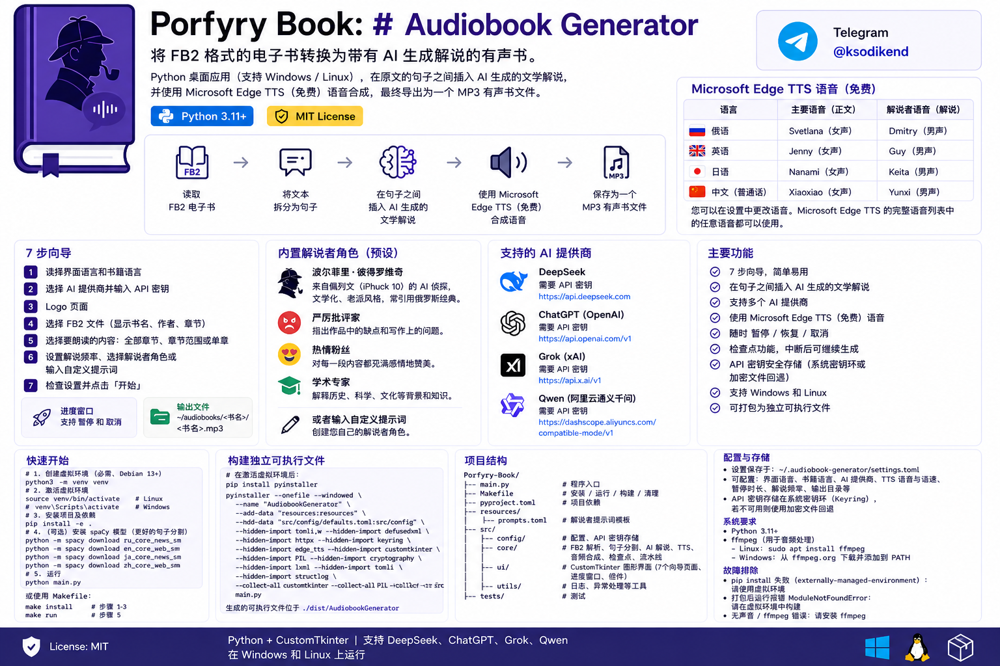

# Audiobook Generator

**将 FB2 电子书转换为带 AI 评论的有声读物。**


[](https://www.python.org/)
[](LICENSE)

**🌍 语言:** [English](README.md) | [Русский](README.ru.md) | [日本語](README.ja.md)

**多语言界面:** 中文 · English · Русский · 日本語

---

## 简介

桌面应用程序（Windows/Linux），可以：

1. 读取 FB2 电子书
2. 拆分为句子
3. 在句子之间添加 AI 生成的评论
4. 通过 **TTS**（云端 Edge TTS 或本地 Piper）合成语音
5. 保存为单个 MP3 文件

技术栈：Python + CustomTkinter。支持 DeepSeek、ChatGPT、Grok、Qwen。

界面支持 **4 种语言** — 在向导第一步即可即时切换。

---

## 快速开始

### 前提条件

- Python 3.11+
- [ffmpeg](https://ffmpeg.org/)（音频处理需要）
  - Linux: `sudo apt install ffmpeg`
  - Windows: 从 ffmpeg.org 下载并添加到 PATH
- （可选）[piper-tts](https://github.com/rhasspy/piper) — 用于本地 CPU TTS（无需网络）

### 安装与运行

```bash
# 1. 创建虚拟环境（Debian 13+ 必须）
python3 -m venv venv

# 2. 激活
source venv/bin/activate   # Linux
# venv\Scripts\activate    # Windows

# 3. 安装应用及所有依赖
pip install -e .

# 4. （可选）安装 spaCy 模型以提高分句精度
python -m spacy download ru_core_news_sm  # 俄语
python -m spacy download en_core_web_sm   # 英语
python -m spacy download ja_core_news_sm  # 日语
python -m spacy download zh_core_web_sm   # 中文

# 5. 运行
python main.py
```

或使用 Makefile：

```bash
make install   # 步骤 1-3
make run       # 步骤 5
```

---

## 构建独立可执行文件

打包成单个文件，无需 Python 即可运行：

```bash
# 先激活 venv，然后：
pip install pyinstaller

# 选项 A：使用 spec 文件（推荐 — 包含 logo.png）
pyinstaller AudiobookGenerator.spec

# 选项 B：使用 Makefile
make build

# 可执行文件：./dist/AudiobookGenerator
```

---

## 使用方法

**7 步向导**（多语言支持）：

| 步骤 | 操作 |
|------|------|
| 1 | 选择**界面语言**（所有页面即时切换）和**书籍语言**（自动匹配 TTS 语音） |
| 2 | 选择 AI 提供商（DeepSeek/ChatGPT/Grok/Qwen）并输入 API 密钥 |
| 3 | 徽标页面 |
| 4 | 选择 FB2 文件（显示标题、作者、章节） |
| 5 | 选择范围：所有章节、范围或单个章节 |
| 6 | 设置评论频率（每 N 句）、评论者角色、自定义提示词，**并选择 TTS 引擎**（云端 Edge TTS 或本地 Piper） |
| 7 | 检查设置并点击**启动** |

生成过程中，**详细的进度窗口**会显示：
- 当前阶段（解析、评论、合成、组装）
- 合成期间：**正在朗读的文本**、语音名称、引擎名称和片段计数器
- 已用时间和预计剩余时间
- **暂停**和**取消**按钮

输出位置：`~/audiobooks/<书名>.mp3`

---

## TTS 引擎

### Edge TTS（默认，云端）

应用使用**免费**的 Microsoft Edge TTS 语音。高质量，但需要网络连接。每种语言的默认语音：

| 语言 | 主语音（文本） | 评论员语音 |
|------|--------------|-----------|
| 🇷🇺 俄语 | **Svetlana**（女声） | **Dmitry**（男声） |
| 🇬🇧 英语 | **Jenny**（女声） | **Guy**（男声） |
| 🇯🇵 日语 | **Nanami**（女声） | **Keita**（男声） |
| 🇨🇳 中文 | **Xiaoxiao**（女声） | **Yunxi**（男声） |

**语音会自动更新** — 在步骤 1 中更改书籍语言时，对应的默认语音会自动应用。也可以在 `~/.audiobook-generator/settings.toml` 中覆盖。可以使用[完整的 Edge TTS 语音列表](https://learn.microsoft.com/en-us/azure/ai-services/speech-service/language-support?tabs=tts)中的任何语音。

### Piper（本地，CPU）

[Piper](https://github.com/rhasspy/piper) 是一个快速的本地神经 TTS 引擎，完全在 CPU 上运行 — 无需网络连接。

- **初始模型下载后无需网络**
- 语音在首次使用时自动下载并缓存到本地
- 质量略低于 Edge TTS，但完全稳定
- 可用语音：

| 语言 | 语音 |
|------|------|
| 🇷🇺 俄语 | **irina**（女声）、**denis**（男声）、**dmitri**（男声）、**ruslan**（男声） |
| 🇬🇧 英语 | **less**（女声）、**amy**（女声）、**joe**（男声）、**sam**（男声）、**ryan**（男声）、**norman**（男声）、**kristin**（女声）、**kusal**（男声） |
| 🇨🇳 中文 | **chaowen**（女声）、**huayan**（女声）、**xiao_ya**（女声） |

**安装方法：** 从[发布页面](https://github.com/rhasspy/piper/releases)下载 `piper` 并添加到 PATH，或通过 `pip install piper-tts` 安装（在 Linux 上可能需要手动编译）。

---

## 内置评论者角色

| 角色 | 风格 |
|------|------|
| **波尔菲里·彼得罗维奇** | 佩列温《iPhuck 10》中的 AI 侦探 — 文学化、老派、引用俄罗斯经典 |
| **严厉的评论家** | 指出弱点和文体错误 |
| **热情的粉丝** | 对每个段落都赞叹不已 |
| **科学专家** | 解释历史、科学和文化背景 |

也可以输入**自定义提示词**来创建自己的角色。

---

## 支持的 AI 提供商

| 提供商 | API 密钥 | 基础 URL |
|--------|---------|----------|
| DeepSeek | 必需 | `https://api.deepseek.com` |
| ChatGPT (OpenAI) | 必需 | `https://api.openai.com/v1` |
| Grok (xAI) | 必需 | `https://api.x.ai/v1` |
| Qwen (阿里云) | 必需 | `https://dashscope.aliyuncs.com/compatible-mode/v1` |

---

## 项目结构

```
├── main.py                    # 入口点 — 运行此文件
├── Makefile                   # install / run / build / clean
├── pyproject.toml             # 依赖关系
├── AudiobookGenerator.spec    # PyInstaller spec（构建配置）
├── logo.png                   # 应用程序徽标
├── resources/
│   └── prompts.toml           # 评论者提示词模板
├── src/
│   ├── config/                # 设置、API 密钥存储
│   ├── core/                  # FB2 解析器、句子分割、AI 评论、
│   │                          # TTS（抽象基类 + Edge + Piper）、音频组装、
│   │                          # 检查点、流程编排器
│   ├── ui/                    # CustomTkinter GUI（7 步向导、进度窗口、组件）
│   └── utils/                 # 日志、异常
└── tests/
```

---

## 配置

首次运行后，设置保存在 `~/.audiobook-generator/settings.toml` 中。

可修改：界面语言、书籍语言、AI 提供商、TTS 引擎（edge/piper）、TTS 语音/速度、停顿时间、评论频率、输出目录。

API 密钥安全存储在系统密钥环中（附带加密文件后备方案）。

---

## 故障排除

**`pip install -e .` 失败，提示 `externally-managed-environment`**
→ 需要使用虚拟环境：`python3 -m venv venv && source venv/bin/activate && pip install -e .`

**没有声音 / ffmpeg 错误**
→ 安装 ffmpeg：`sudo apt install ffmpeg`（Linux）或从 ffmpeg.org 下载（Windows）

**Edge TTS 失败，出现 503 / DNS 错误**
→ 尝试在步骤 6 切换到 **Piper**（本地引擎）。它不需要网络。

**找不到 Piper**
→ 安装 `piper` 二进制文件并添加到 PATH，或使用 Edge TTS。

---

## 许可证

MIT
