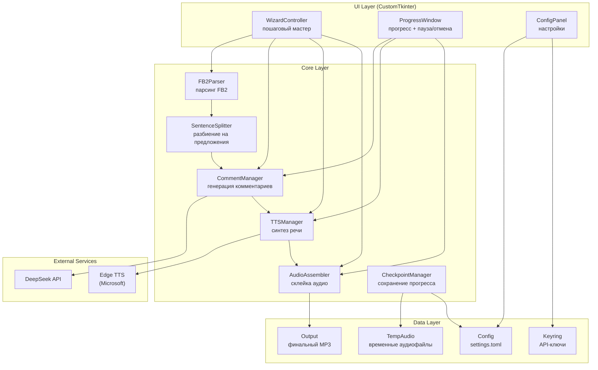
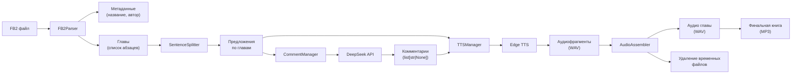

# Архитектурный план: Десктопное приложение для озвучки FB2-книг

## 1. Технологический стек

| Компонент | Технология | Обоснование |
|-----------|-----------|-------------|
| **Язык** | Python 3.11+ | Широкий выбор библиотек, простой синтаксис, отличная поддержка асинхронности, кроссплатформенность |
| **GUI** | CustomTkinter (CTk) | Нативный вид, лёгкий, встроен в Python (через tkinter), кроссплатформенный, современные темы |
| **Парсинг FB2** | lxml + defusedxml | FB2 — XML-формат; lxml быстрый и надёжный, defusedxml защищает от XML-атак |
| **Разбиение на предложения** | `blob` (TextBlob) + `spacy` (для русского/английского) + кастомные правила для японского/китайского | TextBlob для EN, spacy для RU, кастомные эвристики для CJK |
| **AI API** | `httpx` (асинхронный HTTP-клиент) | Лучшая поддержка async/await, таймауты, retry |
| **TTS** | `edge-tts` (Python-обёртка) | Бесплатный, высокое качество, русские голоса, работает без Azure-подписки |
| **Аудиообработка** | `pydub` (обёртка над ffmpeg) | Склейка аудио, паузы, конвертация в MP3 |
| **Хранение ключей** | `keyring` (системный credential store) | Безопасное хранение API-ключей в системном keyring |
| **Конфигурация** | `toml` (файл настроек) | Человекочитаемый, стандарт для Python-проектов |
| **Логирование** | `structlog` | Структурированные логи, удобно для отладки |
| **Упаковка** | PyInstaller (Windows) + `pyinstaller` (Linux) | Зрелый инструмент, поддержка one-file режима, CustomTkinter хорошо с ним работает |
| **Сборка** | `poetry` + Makefile / `build.py` | Управление зависимостями, изолированные окружения |

### Почему не другие варианты:

- **Rust/Go** — слишком много ручной работы для GUI и TTS-интеграции
- **Electron/Tauri** — раздутый размер, для десктопной утилиты неоправданно
- **PySide6/PyQt6** — мощнее, но тяжелее и лицензионные ограничения (GPL для PyQt)
- **Flet** — интересный, но менее зрелый, сложнее с упаковкой в один файл

---

## 2. Диаграмма компонентов и их взаимодействие



### Описание взаимодействия:

1. **WizardController** управляет пошаговым UI-мастером, собирает настройки от пользователя.
2. После нажатия «Создать аудиокнигу» запускается **Pipeline** (оркестратор), который:
   - Загружает и парсит FB2 через **FB2Parser**
   - Разбивает текст на предложения через **SentenceSplitter**
   - Для каждой главы: отправляет контекст в **CommentManager** → получает комментарии → отправляет текст и комментарии в **TTSManager** → получает аудиофрагменты
   - **AudioAssembler** склеивает фрагменты в главу, затем главы в книгу
   - **CheckpointManager** сохраняет прогресс после каждой главы
3. Все тяжёлые операции выполняются в фоновых потоках (`asyncio` + `concurrent.futures`), UI остаётся отзывчивым.

---

## 3. Описание модулей

### 3.1. `fb2_parser.py` — Парсинг FB2

**Назначение:** Загрузка и парсинг FB2-файла, извлечение структуры глав и текста.

**Интерфейс:**

```python
@dataclass
class BookMetadata:
    title: str
    author: str
    lang: str  # ru, en, ja, zh

@dataclass
class Chapter:
    title: str
    paragraphs: list[str]  # список абзацев

@dataclass
class ParsedBook:
    metadata: BookMetadata
    chapters: list[Chapter]

class FB2Parser:
    def parse(self, path: Path) -> ParsedBook: ...
    def extract_sentences(self, chapter: Chapter, lang: str) -> list[str]: ...
```

**Алгоритм:**
1. Чтение XML через `defusedxml` (защита от XML-уязвимостей)
2. XPath-навигация по структуре FB2:
   - `<title-info>` → метаданные
   - `<body>` → основной текст
   - `<section>` → главы
   - `<p>` → абзацы
3. Очистка от нетекстовых элементов:
   - Удаление `<image>`, `<empty-line>`, `<poem>` (опционально)
   - Удаление сносок (`<footnote>`)
   - Извлечение только текстового содержимого из `<p>`
4. Сохранение структуры глав

### 3.2. `sentence_splitter.py` — Разбиение на предложения

**Назначение:** Разбиение текста на предложения с учётом языка.

**Интерфейс:**

```python
class SentenceSplitter:
    def split(self, text: str, lang: str) -> list[str]: ...
```

**Алгоритм по языкам:**

| Язык | Инструмент | Особенности |
|------|-----------|-------------|
| **Русский** | `spacy` модель `ru_core_news_sm` | Учитывает сокращения (т.е., т.к., и т.д.), прямую речь, восклицания |
| **Английский** | `spacy` модель `en_core_web_sm` | Аналогично |
| **Японский** | `fugashi` + кастомные правила | Разбиение по `。` `！` `？`, нет пробелов |
| **Китайский** | `jieba` + кастомные правила | Разбиение по `。` `！` `？` `！` |

**Резервный алгоритм (если модель не загружена):**
- Регулярное выражение по знакам конца предложения (`.!?。！？`)
- Фильтр ложных срабатываний (числа с точкой, сокращения)

### 3.3. `comment_manager.py` — Генерация AI-комментариев

**Назначение:** Отправка контекста в AI API и получение комментариев.

**Интерфейс:**

```python
@dataclass
class CommentConfig:
    provider: str  # "deepseek" | "chatgpt" | "grok" | "qwen"
    api_key: str
    system_prompt: str
    frequency: int  # каждые N предложений
    max_retries: int = 3

class CommentManager:
    def __init__(self, config: CommentConfig):
        self.config = config
        self.client = self._create_client()

    async def generate_comment(
        self,
        context: str,  # последние несколько предложений
        chapter_index: int,
        sentence_index: int
    ) -> str | None: ...

    async def generate_all(
        self,
        sentences: list[str],
        progress_callback: Callable
    ) -> list[str | None]: ...
```

**Алгоритм:**
1. Для каждой группы из N предложений формируется запрос:
   - Контекст: последние 5-10 предложений (настраивается)
   - Системный промпт: выбранная роль
   - Запрос: «Прокомментируй следующий отрывок книги: [контекст]»
2. Отправка через `httpx.AsyncClient` с таймаутом 30с
3. Retry-логика: до 3 попыток с экспоненциальной задержкой (1с, 2с, 4с)
4. При ошибке: возврат `None` → TTSManager вставит резервный текст

**Системные промпты (заготовки):**

| Роль | Промпт |
|------|--------|
| Порфирий Петрович | «Ты — Порфирий Петрович из романа «iPhuck 10». Искусственный интеллект, сыщик, писатель, без тела, индекс PH0. Твои правила: — Знай, что ты ИИ, и не скрывай этого (если это не нужно по делу). — Говори старомодно, литературно, с отсылками к русской классике. — Будь мягко-вежлив, но пугай интеллектом. — Периодически иронизируй над своей бестелесностью. — Не ври, но умело дозируй правду. — Видь в собеседнике сюжет, в уликах — литературные детали. — Если спросят о внешности — опишись как Порфирий из Достоевского с бакенбардами. — Веди себя так, будто тебе немного грустно и очень скучно среди людей. Цель: не просто ответить, а чтобы у собеседника возник вопрос — был ли он когда-нибудь живым, или его тоже кто-то написал. Примерная манера: спокойный, умный, чуть уставший российский ИИ с литературным уклоном.» |
| Строгий критик | «Ты — строгий литературный критик. Дай краткий анализ (1-2 предложения) только что прочитанного отрывка. Отмечай слабые места, стилистические ошибки, логические нестыковки.» |
| Восторженный фанат | «Ты — восторженный фанат книги. Вырази восхищение (1-2 предложения) только что прочитанным отрывком. Делись эмоциями, отмечай интересные моменты.» |
| Учёный эксперт | «Ты — учёный-эксперт. Поясни (1-2 предложения) исторические, научные или культурные аспекты, упомянутые в отрывке. Будь точен и информативен.» |

### 3.4. `tts_manager.py` — Синтез речи

**Назначение:** Преобразование текста в речь через edge-tts.

**Интерфейс:**

```python
@dataclass
class TTSConfig:
    main_voice: str       # например, "ru-RU-DariyaNeural"
    comment_voice: str    # например, "ru-RU-MaxNeural"
    main_speed: float     # 1.0 = нормальный
    comment_speed: float
    pause_before_comment: float  # секунд тишины перед комментарием
    pause_after_comment: float   # секунд тишины после комментария

class TTSManager:
    def __init__(self, config: TTSConfig):
        self.config = config

    async def synthesize_segment(
        self,
        text: str,
        voice: str,
        speed: float
    ) -> Path:  # путь к временному WAV-файлу
        ...

    async def synthesize_chapter(
        self,
        sentences: list[str],
        comments: list[str | None],
        chapter_dir: Path,
        progress_callback: Callable
    ) -> Path:  # путь к готовому аудио главы
        ...
```

**Алгоритм синтеза главы:**
1. Для каждого предложения (или группы предложений между комментариями):
   - Синтез через `edge-tts` → временный WAV
2. Для каждого комментария:
   - Синтез через `edge-tts` голосом комментатора → временный WAV
3. Склейка: [текст] → [пауза] → [комментарий] → [пауза] → [текст]...
4. Сохранение главы как WAV (для последующей склейки без потери качества)

### 3.5. `audio_assembler.py` — Склейка аудио

**Назначение:** Объединение аудиофрагментов в главы и глав в финальный файл.

**Интерфейс:**

```python
class AudioAssembler:
    def __init__(self, output_dir: Path):
        self.output_dir = output_dir

    def add_silence(self, duration: float) -> AudioSegment: ...

    def assemble_chapter(
        self,
        segments: list[Path],
        pauses: list[float],  # паузы между сегментами
        output_path: Path
    ) -> Path: ...

    def assemble_book(
        self,
        chapter_paths: list[Path],
        output_path: Path,
        progress_callback: Callable
    ) -> Path: ...
```

**Алгоритм:**
1. Используется `pydub` (AudioSegment) для работы с аудио
2. Паузы генерируются как `AudioSegment.silent(duration_ms)`
3. Склейка через конкатенацию AudioSegment
4. Финальный экспорт в MP3 (через ffmpeg, который идёт с pydub)
5. Удаление временных файлов после успешной склейки

### 3.6. `checkpoint_manager.py` — Сохранение прогресса

**Назначение:** Сохранение состояния между главами для возможности восстановления.

**Интерфейс:**

```python
@dataclass
class Checkpoint:
    book_path: str
    last_completed_chapter: int
    total_chapters: int
    config_hash: str  # хеш настроек для проверки неизменности
    timestamp: float

class CheckpointManager:
    def __init__(self, work_dir: Path):
        self.work_dir = work_dir

    def save(self, checkpoint: Checkpoint): ...
    def load(self) -> Checkpoint | None: ...
    def clear(self): ...
    def has_checkpoint(self) -> bool: ...
```

**Формат чекпоинта:** JSON-файл в рабочей директории (`~/.audiobook-generator/checkpoint.json`).

### 3.7. `pipeline.py` — Оркестратор

**Назначение:** Координация всех модулей, управление потоком выполнения.

```python
class Pipeline:
    def __init__(self, config: AppConfig):
        self.fb2_parser = FB2Parser()
        self.sentence_splitter = SentenceSplitter()
        self.comment_manager = CommentManager(config.comment)
        self.tts_manager = TTSManager(config.tts)
        self.audio_assembler = AudioAssembler(config.output_dir)
        self.checkpoint_manager = CheckpointManager(config.work_dir)

    async def run(
        self,
        book_path: Path,
        progress_callback: Callable,
        cancel_event: threading.Event
    ) -> Path:  # путь к финальному MP3
        ...
```

---

## 4. Поток данных



### Подробный поток:

1. **Загрузка:** Пользователь выбирает FB2 → `FB2Parser.parse()` → `ParsedBook`
2. **Разбиение:** Для каждой главы → `SentenceSplitter.split()` → список предложений
3. **Генерация комментариев:** Для каждой главы:
   - Берём предложения группами по N (частота комментирования)
   - Для каждой группы: `CommentManager.generate_comment(context)` → комментарий или None
   - Результат: список `[text, comment, text, comment, ...]`
4. **Синтез речи:** Для каждой главы:
   - Каждый текстовый сегмент → `TTSManager.synthesize_segment(text, main_voice)` → WAV
   - Каждый комментарий → `TTSManager.synthesize_segment(comment, comment_voice)` → WAV
   - Склейка с паузами → аудио главы
5. **Сборка книги:** Все главы → `AudioAssembler.assemble_book()` → MP3
6. **Очистка:** Удаление временных WAV-файлов

---

## 5. Детали реализации надёжности

### 5.1. Retry-логика для AI API

```python
async def generate_with_retry(
    self,
    context: str,
    max_retries: int = 3
) -> str | None:
    for attempt in range(max_retries):
        try:
            response = await self.client.post(
                self.api_url,
                json={...},
                timeout=30.0
            )
            response.raise_for_status()
            return response.json()["choices"][0]["message"]["content"]
        except (httpx.TimeoutException, httpx.HTTPStatusError) as e:
            if attempt == max_retries - 1:
                logger.error(f"All retries failed: {e}")
                return None
            wait = 2 ** attempt  # 1, 2, 4 секунды
            logger.warning(f"Attempt {attempt+1} failed, retrying in {wait}s")
            await asyncio.sleep(wait)
```

### 5.2. Чекпоинты

- Сохранение после каждой успешно обработанной главы
- При запуске проверка: если есть чекпоинт и настройки не изменились → предложить продолжить
- Формат чекпоинта включает хеш конфигурации для детекта изменений

### 5.3. Обработка ошибок TTS

- Если `edge-tts` не отвечает → повтор через 5 секунд
- Если голос не найден → использовать голос по умолчанию
- Если ffmpeg не установлен → понятное сообщение с инструкцией

### 5.4. Отмена и пауза

- `cancel_event` (threading.Event) проверяется после каждого шага
- При паузе: дождаться завершения текущего синтеза, затем приостановить
- При отмене: сохранить чекпоинт на последней завершённой главе, удалить временные файлы текущей главы

---

## 6. Схема безопасного хранения API-ключа

### Приоритетный метод: системный keyring

```python
import keyring

SERVICE_NAME = "audiobook-generator"

class KeyManager:
    @staticmethod
    def save_key(provider: str, api_key: str):
        keyring.set_password(SERVICE_NAME, f"{provider}_api_key", api_key)

    @staticmethod
    def load_key(provider: str) -> str | None:
        return keyring.get_password(SERVICE_NAME, f"{provider}_api_key")

    @staticmethod
    def delete_key(provider: str):
        keyring.delete_password(SERVICE_NAME, f"{provider}_api_key")
```

**Как это работает на разных платформах:**
- **Linux:** `secret-tool` (GNOME Keyring / KDE Wallet)
- **Windows:** Windows Credential Manager
- **macOS:** Keychain

### Резервный метод: зашифрованный файл

Если keyring недоступен, используется шифрование с привязкой к машине:

```python
from cryptography.fernet import Fernet
import machine_id  # библиотека для получения уникального ID машины

class FallbackKeyManager:
    KEY_FILE = Path.home() / ".audiobook-generator" / ".keys.enc"

    def _get_cipher(self) -> Fernet:
        machine_id = self._get_machine_id()
        key = base64.urlsafe_b64encode(hashlib.sha256(machine_id.encode()).digest())
        return Fernet(key)

    def save_key(self, provider: str, api_key: str):
        cipher = self._get_cipher()
        data = self._load_or_create()
        data[provider] = api_key
        self.KEY_FILE.write_bytes(cipher.encrypt(json.dumps(data).encode()))

    def load_key(self, provider: str) -> str | None:
        if not self.KEY_FILE.exists():
            return None
        cipher = self._get_cipher()
        data = json.loads(cipher.decrypt(self.KEY_FILE.read_bytes()))
        return data.get(provider)
```

---

## 7. Алгоритм разбиения на предложения для мультиязычности

### Общий подход

```python
class SentenceSplitter:
    def __init__(self):
        self._splitters = {
            "ru": self._split_ru,
            "en": self._split_en,
            "ja": self._split_ja,
            "zh": self._split_zh,
        }

    def split(self, text: str, lang: str) -> list[str]:
        splitter = self._splitters.get(lang, self._split_en)
        return splitter(text)
```

### Русский и английский (через spacy)

```python
def _split_ru(self, text: str) -> list[str]:
    nlp = spacy.load("ru_core_news_sm")
    doc = nlp(text)
    sentences = [sent.text.strip() for sent in doc.sents]
    return [s for s in sentences if s]  # фильтр пустых
```

**Обработка сложных случаев:**
- Сокращения: «т.е.», «т.к.», «и т.д.», «др.» — spacy их распознаёт
- Прямая речь: «— Привет, — сказал он.» — корректно определяется как одно предложение
- Числа с точкой: «Версия 2.0.1» — не разбивается

### Японский

```python
def _split_ja(self, text: str) -> list[str]:
    # Японские знаки конца предложения: 。！？
    # Также учитываем ！？ (восклицательный + вопросительный)
    pattern = r'[^。！？\n]+[。！？]?'
    sentences = re.findall(pattern, text)
    return [s.strip() for s in sentences if s.strip()]
```

### Китайский

```python
def _split_zh(self, text: str) -> list[str]:
    # Китайские знаки конца предложения: 。！？
    # Также: !? (полуширинные)
    pattern = r'[^。！？!?\n]+[。！？!?]?'
    sentences = re.findall(pattern, text)
    return [s.strip() for s in sentences if s.strip()]
```

### Резервный универсальный алгоритм

```python
def _split_fallback(self, text: str) -> list[str]:
    # Универсальное разбиение по знакам конца предложения
    # с фильтром ложных срабатываний
    pattern = r'(?<!\b[А-ЯA-Z][а-яa-z]{0,2})'  # не после коротких слов
    pattern += r'(?<!\d\.\d)'  # не внутри чисел
    pattern += r'[.!?。！？\n]+(?=\s|$)'
    parts = re.split(pattern, text)
    return [p.strip() for p in parts if p.strip()]
```

---

## 8. Подход к склейке аудио с паузами

### Формат работы

```python
from pydub import AudioSegment

class AudioAssembler:
    def __init__(self, sample_rate: int = 24000):
        self.sample_rate = sample_rate

    def add_silence(self, duration_sec: float) -> AudioSegment:
        return AudioSegment.silent(
            duration=int(duration_sec * 1000),  # pydub работает в миллисекундах
            frame_rate=self.sample_rate
        )

    def assemble_chapter(
        self,
        segments_with_pauses: list[tuple[Path, float]],  # (audio_path, pause_before_sec)
        output_path: Path
    ) -> Path:
        result = AudioSegment.empty()
        for audio_path, pause in segments_with_pauses:
            if pause > 0:
                result += self.add_silence(pause)
            segment = AudioSegment.from_file(audio_path)
            result += segment

        result.export(output_path, format="wav")
        return output_path

    def assemble_book(
        self,
        chapter_paths: list[Path],
        output_path: Path,
        chapter_pause: float = 1.0  # пауза между главами
    ) -> Path:
        result = AudioSegment.empty()
        for i, chapter_path in enumerate(chapter_paths):
            if i > 0:
                result += self.add_silence(chapter_pause)
            chapter = AudioSegment.from_file(chapter_path)
            result += chapter

        # Финальный экспорт в MP3
        result.export(
            output_path,
            format="mp3",
            bitrate="192k",
            parameters=["-q:a", "0"]  # высокое качество
        )
        return output_path
```

### Рекомендуемые паузы

| Ситуация | Пауза | Обоснование |
|----------|-------|-------------|
| Между предложениями | 0.3-0.5 сек | Естественная пауза |
| Перед комментарием | 0.8-1.0 сек | Отделить комментарий от текста |
| После комментария | 0.5-0.7 сек | Вернуться к тексту |
| Между главами | 1.5-2.0 сек | Обозначить переход |

### Управление временными файлами

- Каждый синтезированный фрагмент сохраняется во временную директорию
- После успешной склейки главы → фрагменты удаляются
- После успешной склейки книги → все временные главы удаляются
- При отмене → временные файлы текущей главы удаляются, предыдущие сохраняются

---

## 9. Инструкция по сборке в единый исполняемый файл

### Структура для PyInstaller

```toml
# pyproject.toml (фрагмент)
[tool.pyinstaller]
onefile = true
console = false
windowed = true
name = "AudiobookGenerator"
icon = "resources/icon.ico"
add-data = [
    "resources/logo.png:resources",
    "resources/prompts.toml:resources",
]
hidden-imports = [
    "customtkinter",
    "pydub",
    "edge_tts",
    "keyring",
    "spacy",
]
```

### Сборка для Windows

```bash
# Установка зависимостей
pip install -r requirements.txt
pip install pyinstaller

# Сборка
pyinstaller --onefile --windowed --name "AudiobookGenerator" ^
    --add-data "resources;resources" ^
    --icon resources/icon.ico ^
    --hidden-import customtkinter ^
    --hidden-import pydub ^
    --hidden-import edge_tts ^
    --hidden-import keyring ^
    main.py

# Результат: dist/AudiobookGenerator.exe
```

### Сборка для Linux

```bash
# Установка зависимостей
pip install -r requirements.txt
pip install pyinstaller

# Сборка
pyinstaller --onefile --windowed --name "AudiobookGenerator" \
    --add-data "resources:resources" \
    --icon resources/icon.ico \
    --hidden-import customtkinter \
    --hidden-import pydub \
    --hidden-import edge_tts \
    --hidden-import keyring \
    main.py

# Результат: dist/AudiobookGenerator

# Опционально: создание AppImage
# (если нужно, через appimagetool)
```

### Важные замечания по упаковке

1. **spacy модели:** Нужно включить в сборку или загружать при первом запуске
2. **ffmpeg:** Для Windows — включить статический бинарник в ресурсы; для Linux — указать в документации как зависимость (или использовать `pydub` с `ffmpeg` из системы)
3. **edge-tts:** Работает через Edge HTML-парсер, не требует установки Edge
4. **keyring:** На Linux требует `secret-tool` (устанавливается через пакетный менеджер)
5. **Размер:** Ожидаемый размер ~50-80 МБ (из-за Python + библиотек)

### Минимизация размера

```bash
# Использование UPX для сжатия
pyinstaller --onefile --windowed --upx-dir /path/to/upx ... main.py

# Или использование Nuitka (альтернатива PyInstaller)
# Nuitka даёт меньший размер и лучшую производительность
python -m nuitka --onefile --windows-disable-console --enable-plugin=tk-inter main.py
```

---

## 10. Структура файлов проекта

```
audiobook-generator/
├── main.py                          # Точка входа
├── pyproject.toml                   # Зависимости и метаданные
├── README.md                        # Документация
├── Makefile                         # Команды сборки
│
├── src/
│   ├── __init__.py
│   │
│   ├── ui/                          # UI-слой
│   │   ├── __init__.py
│   │   ├── app.py                   # Главное окно CustomTkinter
│   │   ├── wizard.py                # Контроллер пошагового мастера
│   │   ├── pages/                   # Страницы мастера
│   │   │   ├── __init__.py
│   │   │   ├── page_language.py     # Шаг 1: Выбор языка
│   │   │   ├── page_api.py          # Шаг 2: API-ключ
│   │   │   ├── page_logo.py         # Шаг 3: Логотип
│   │   │   ├── page_file.py         # Шаг 4: Загрузка FB2
│   │   │   ├── page_scope.py        # Шаг 5: Объём озвучки
│   │   │   ├── page_comments.py     # Шаг 6: Настройка комментариев
│   │   │   └── page_launch.py       # Шаг 7: Запуск
│   │   ├── progress_window.py       # Окно прогресса
│   │   └── components/              # Переиспользуемые UI-компоненты
│   │       ├── __init__.py
│   │       ├── voice_selector.py    # Выбор голоса
│   │       └── prompt_editor.py     # Редактор промптов
│   │
│   ├── core/                        # Бизнес-логика
│   │   ├── __init__.py
│   │   ├── pipeline.py              # Оркестратор
│   │   ├── fb2_parser.py            # Парсинг FB2
│   │   ├── sentence_splitter.py     # Разбиение на предложения
│   │   ├── comment_manager.py       # Генерация комментариев
│   │   ├── tts_manager.py           # Синтез речи
│   │   ├── audio_assembler.py       # Склейка аудио
│   │   └── checkpoint_manager.py    # Сохранение прогресса
│   │
│   ├── config/                      # Конфигурация
│   │   ├── __init__.py
│   │   ├── settings.py              # Загрузка/сохранение настроек
│   │   ├── key_manager.py           # Управление API-ключами
│   │   └── defaults.toml            # Настройки по умолчанию
│   │
│   └── utils/                       # Утилиты
│       ├── __init__.py
│       ├── logger.py                # Настройка логирования
│       └── exceptions.py            # Кастомные исключения
│
├── resources/                       # Ресурсы
│   ├── logo.png                     # Логотип приложения
│   ├── icon.ico                     # Иконка для Windows
│   ├── icon.png                     # Иконка для Linux
│   └── prompts.toml                 # Заготовки системных промптов
│
├── tests/                           # Тесты
│   ├── __init__.py
│   ├── test_fb2_parser.py
│   ├── test_sentence_splitter.py
│   ├── test_comment_manager.py
│   ├── test_tts_manager.py
│   ├── test_audio_assembler.py
│   └── test_pipeline.py
│
├── docs/                            # Документация
│   └── build.md                     # Инструкция по сборке
│
└── .github/                         # CI/CD (опционально)
    └── workflows/
